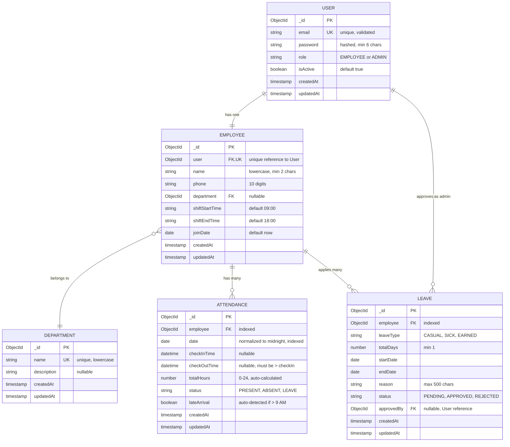

# ER Diagram - Employee Management System

## 📊 Complete ER Diagram

---

## 📋 Table Summary

| Table | Description | Key Relationships |
|-------|-------------|-------------------|
| **USER** | All platform users with authentication credentials (employees and admins) | → Employee (1:1), → Leave as approver |
| **EMPLOYEE** | Employee profiles with personal details and work information | ← User (1:1), → Department, → Attendance, → Leave |
| **DEPARTMENT** | Organizational departments for employee grouping | ← Employee (many employees per department) |
| **ATTENDANCE** | Daily attendance records with check-in/out times and auto-calculations | ← Employee, auto-calculates hours and late arrivals |
| **LEAVE** | Leave applications with approval workflow and status tracking | ← Employee (applicant), ← User (approver) |

---

**Last Updated**: Feb 2026