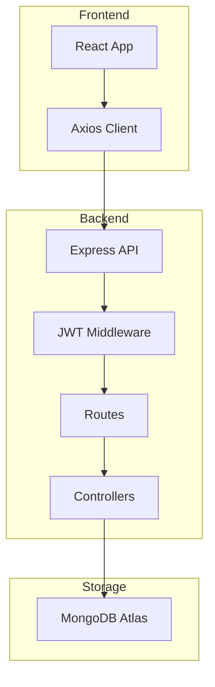

# AttendanceIQ : Attendance & Employee Management

A premium, full-stack Human Resource Management System (HRMS) built for modern enterprises. This automates attendance tracking, leave management, and employee administration with a clean, high-performance architecture.

---

## Key Features

### For Employees
- **Smart Attendance**: One-click check-in/check-out with real-time hour calculation.
- **Leave Portal**: Apply for Sick, Casual, or Earned leaves and track approval status.
- **Personal Dashboard**: View your own attendance history and performance stats.

### For Admins
- **Employee Lifecycle**: Create, update, and manage employee profiles and departments.
- **Automated Attendance**: Automatic late arrival detection (based on 9 AM shift) and "Present" tagging.
- **Leave Management System**: Centralized dashboard to approve or reject leave requests.
- **Visual Reports**: Department-wise listing and monthly attendance insights.

---

## 🛠️ Tech Stack

| Layer | Technologies |
|---|---|
| **Frontend** | React, TypeScript, Tailwind CSS, Axios, React Router |
| **Backend** | Node.js, Express, TypeScript, Morgan |
| **Database** | MongoDB, Mongoose |
| **Security** | JWT Authentication, Bcrypt Password Hashing |

---

## System Architecture



---

## 📁 Project Structure

```bash
attendance-manager/
├── backend/            # Express.js + TS Server
│   ├── src/
│   │   ├── config/     # Database configuration
│   │   ├── models/     # Mongoose schemas
│   │   ├── controllers/# Business logic handlers
│   │   ├── routes/     # API endpoints
├── frontend/           # React + Tailwind Frontend
│   ├── src/
│   │   ├── components/ # Reusable UI components
│   │   ├── pages/      # Route-level components
│   │   └── context/    # State management
```

---

## Getting Started

### Prerequisites
- Node.js (v18+)
- MongoDB (Local or Atlas)
- npm

### 1. Backend Setup
```bash
cd backend
npm install
# Create a .env file with PORT, MONGO_URI, and JWT_SECRET
npm run dev
```

### 2. Frontend Setup
```bash
cd frontend
npm install
npm run dev
```

---

## Security & Optimization
- **RBAC**: Role-Based Access Control ensuring employees only see their data.
- **Encryption**: Industry-standard bcrypt hashing for secure password storage.
- **Performance**: Layered internal architecture (Repository Pattern) for scalability.
- **Validations**: Strict input validation using Mongoose and custom middlewares.

---