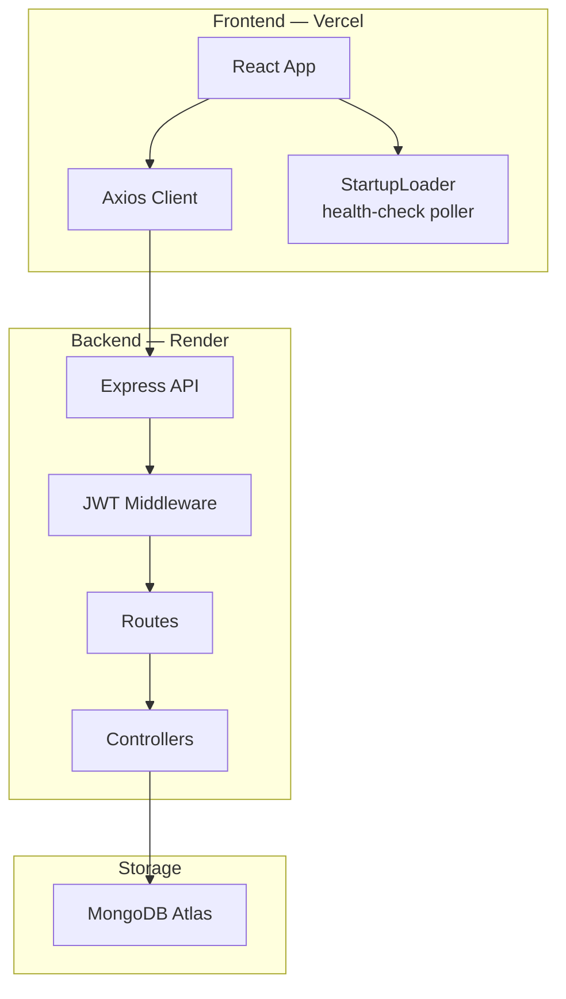

# AttendanceIQ — Attendance & Employee Management

> A premium, full-stack Human Resource Management System (HRMS) built for modern enterprises. Automates attendance tracking, leave management, and employee administration with a clean, high-performance architecture.

---

## 🚀 Live Demo

**[https://attendance-manager-pi-blush.vercel.app](https://attendance-manager-pi-blush.vercel.app)**

> **Note:** The backend is hosted on Render's free tier, which spins down after inactivity. On first load you'll see a **"Waking up the server…"** splash screen — it disappears automatically in under a minute once the server is ready.

---

## ✨ Key Features

### For Employees
- **Smart Attendance** — One-click check-in/check-out with real-time hour calculation
- **Leave Portal** — Apply for Sick, Casual, or Earned leaves and track approval status
- **Personal Dashboard** — View your own attendance history and performance stats

### For Admins
- **Employee Lifecycle** — Create, update, and manage employee profiles and departments
- **Automated Attendance** — Automatic late-arrival detection (based on a 9 AM shift) and "Present" tagging
- **Leave Management** — Centralized dashboard to approve or reject leave requests
- **Visual Reports** — Department-wise listing and monthly attendance insights

---

## 🛠️ Tech Stack

| Layer | Technologies |
|---|---|
| **Frontend** | React 18, TypeScript, Tailwind CSS v4, Axios, React Router v6 |
| **Backend** | Node.js, Express, TypeScript, Morgan |
| **Database** | MongoDB Atlas, Mongoose |
| **Security** | JWT Authentication, Bcrypt Password Hashing |
| **Deployment** | Vercel (frontend) · Render (backend) |

---

## System Architecture



---

## 📁 Project Structure

```bash
attendance-manager/
├── backend/                  # Express.js + TypeScript server
│   └── src/
│       ├── config/           # Database configuration
│       ├── models/           # Mongoose schemas
│       ├── controllers/      # Business logic handlers
│       ├── middlewares/      # Auth & error middleware
│       └── routes/           # API endpoints
└── frontend/                 # React + Tailwind frontend
    └── src/
        ├── api/              # Axios instance & interceptors
        ├── components/       # Reusable UI components
        │   └── Shared/
        │       ├── Layout.tsx
        │       └── StartupLoader.tsx   # cold-start loader
        ├── pages/            # Route-level components
        └── context/          # Auth state management
```

---

## 🏁 Getting Started

### Prerequisites
- Node.js v18+
- MongoDB (Local or Atlas)
- npm

### 1. Clone the repo
```bash
git clone https://github.com/kshitij2212/attendance-manager.git
cd attendance-manager
```

### 2. Backend Setup
```bash
cd backend
npm install
cp .env.example .env   # Fill in PORT, MONGO_URI, JWT_SECRET
npm run dev
```

### 3. Frontend Setup
```bash
cd frontend
npm install
cp .env.example .env   # Set VITE_API_URL=http://localhost:8000/api
npm run dev
```

---

## 🔒 Security & Optimization

- **RBAC** — Role-Based Access Control: employees only see their own data
- **Encryption** — Industry-standard bcrypt hashing for password storage
- **Performance** — Layered architecture (Repository Pattern) for scalability
- **Validations** — Strict input validation via Mongoose schemas and custom middlewares
- **Startup UX** — Frontend polls `/api/health` and shows an animated loader during Render cold-starts

---