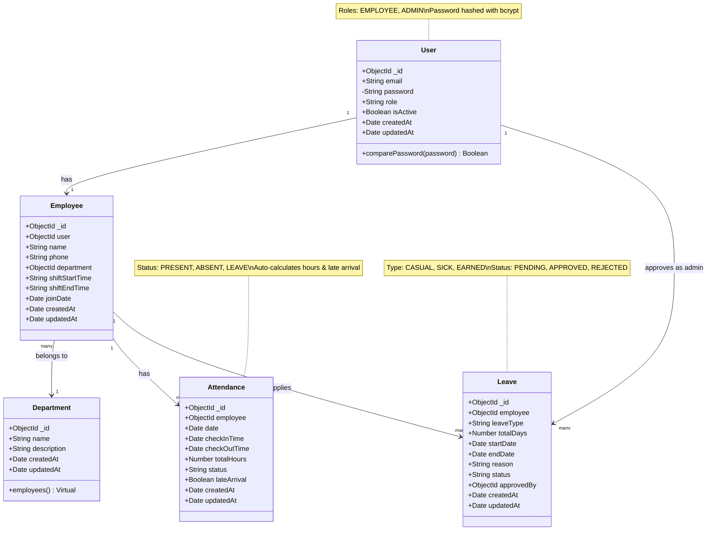
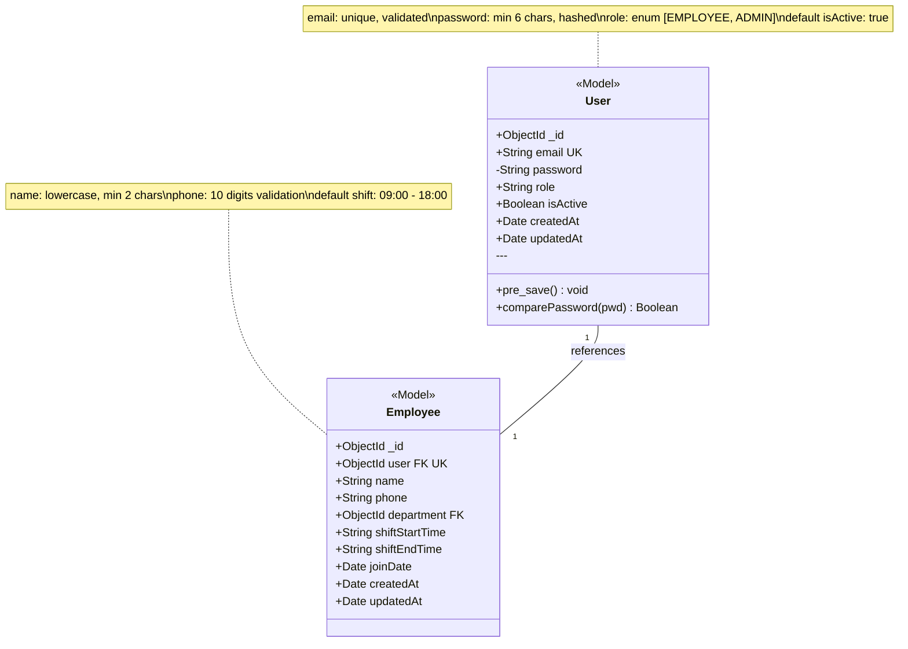
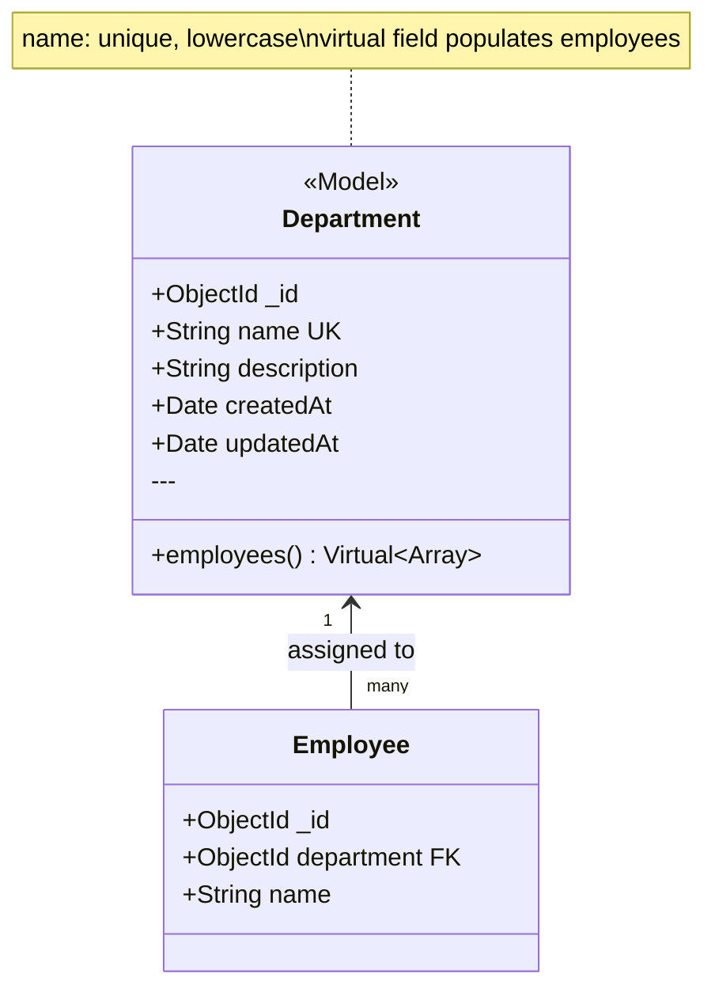
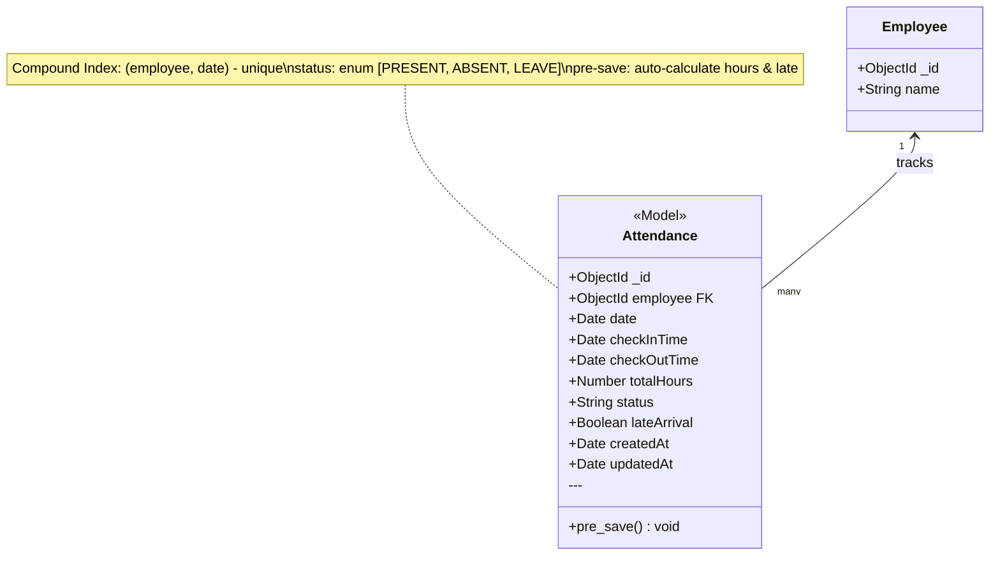
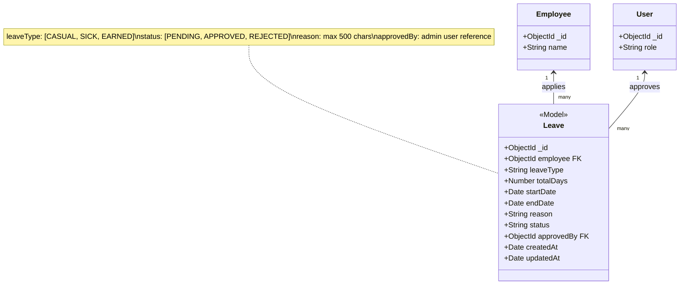
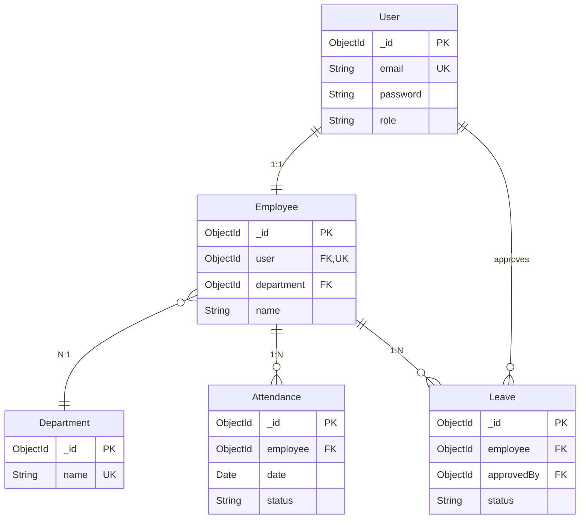

# Class Diagram - Employee Management System

## 📦 Complete System Class Diagram



---

## 🔐 User & Employee Classes



---

## 🏢 Department Class



---

## 📅 Attendance Class



### Pre-save Hook Logic
```javascript
1. Normalize date to midnight
2. If status=LEAVE → clear checkIn/Out, hours, late
3. If checkIn exists → auto-mark PRESENT
4. Calculate totalHours if both times exist
5. Detect lateArrival if checkIn > 9:00 AM
```

---

## 🏖️ Leave Class



---

## 🔗 Relationships Summary



---

## 📊 Class Properties Details

### Validation Rules

| Class | Field | Validation |
|-------|-------|------------|
| User | email | Unique, regex: `/^\S+@\S+\.\S+$/` |
| User | password | Min 6 chars, hashed with bcrypt |
| User | role | Enum: EMPLOYEE, ADMIN |
| Employee | name | Min 2 chars, lowercase, trimmed |
| Employee | phone | Regex: `/^\d{10}$/` |
| Employee | user | Unique (1-to-1 with User) |
| Department | name | Unique, lowercase, trimmed |
| Attendance | date | Normalized to midnight |
| Attendance | checkOutTime | Must be > checkInTime |
| Attendance | totalHours | Min: 0, Max: 24 |
| Attendance | (employee, date) | Compound unique index |
| Leave | totalDays | Min: 1 |
| Leave | reason | Max 500 chars |

### Default Values

| Class | Field | Default |
|-------|-------|---------|
| User | role | "EMPLOYEE" |
| User | isActive | true |
| Employee | shiftStartTime | "09:00" |
| Employee | shiftEndTime | "18:00" |
| Employee | joinDate | Date.now |
| Attendance | status | "ABSENT" |
| Attendance | lateArrival | false |
| Leave | status | "PENDING" |
| Department | description | null |

---

## 🎯 Key Design Patterns

### 1. Repository Pattern
- Models encapsulate data access
- Mongoose handles CRUD operations
- Pre/post hooks for business logic

### 2. Virtual Properties
- Department has virtual `employees` field
- Populates related employees dynamically

### 3. Middleware Hooks
- **User pre-save**: Hash password if modified
- **Attendance pre-save**: Auto-calculations
- **User methods**: comparePassword()

### 4. Referential Integrity
- Foreign keys with `ref` to other models
- Populated queries for related data

---

## 📝 Method Signatures

```javascript
// User methods
userSchema.methods.comparePassword(enteredPassword: String): Promise<Boolean>

// Attendance pre-save hook
attendanceSchema.pre("save", function(next: Function): void)

// Department virtual field
departmentSchema.virtual("employees", {
  ref: "Employee",
  localField: "_id",
  foreignField: "department"
})
```

---

**Last Updated**: Feb 2026