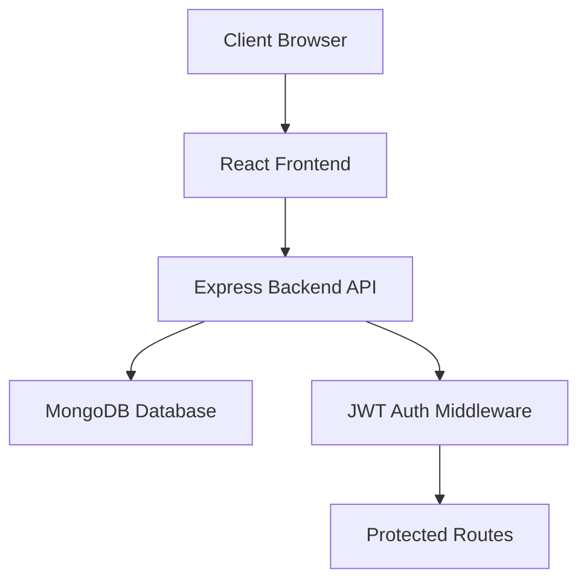

# SmartHRMS - Project Idea

## 🎯 Overview
A full-stack Employee Management System (HRMS) for managing employees, attendance, leaves, and departments with role-based access control.

## 🛠️ Tech Stack

### Backend
- Node.js + Express.js
- TypeScript
- MongoDB + Mongoose
- JWT Authentication
- bcryptjs for password hashing

### Frontend
- React.js (Vite)
- TypeScript
- Tailwind CSS 
- Axios for API calls
- React Router for navigation
---

## 🏗️ System Architecture


---

## 🎨 Core Features

### 1. Authentication & Authorization
- User registration and login (JWT-based)
- Two roles: **ADMIN** and **EMPLOYEE**
- Role-based access control (RBAC)
- Password encryption with bcrypt

### 2. Employee Management
- Create, view, update, delete employees
- Assign employees to departments
- Manage shift timings (default: 9 AM - 6 PM)
- Employee profile with personal details

### 3. Department Management
- Create and manage departments
- Assign multiple employees to departments
- View all employees in a department
- Department-wise employee listing

### 4. Attendance System
- **Check-in/Check-out**: Employees mark daily attendance
- **Auto-calculations**:
  - Total hours worked
  - Late arrival detection (after 9 AM)
  - Auto-mark PRESENT on check-in
- **Attendance status**: PRESENT, ABSENT, LEAVE
- **Reports**: Daily, monthly attendance reports
- **Business rules**:
  - One attendance per employee per day
  - Check-out must be after check-in
  - Leave status nullifies check-in/out

### 5. Leave Management
- **Leave types**: CASUAL, SICK, EARNED

- **Auto-attendance marking**: Approved leaves auto-create attendance records with status=LEAVE
- Employees can apply, admins approve/reject
- View leave history and status

---

## 👥 User Roles & Permissions

### ADMIN
✅ Full system access  
✅ Manage all employees and departments  
✅ View all attendance records  
✅ Approve/reject leave requests  
✅ Generate reports  

### EMPLOYEE
✅ View own profile  
✅ Mark own attendance (check-in/out)  
✅ Apply for leaves  
✅ View own attendance history  
✅ View own leave status  
❌ Cannot access other employees' data  

---

## 🚀 API Endpoints 

### Auth (`/api/auth`)
- `POST /register` - Register new user
- `POST /login` - Login user (returns JWT)
- `GET /me` - Get current user profile

### Employees (`/api/employees`)
- `POST /` - Create employee [ADMIN]
- `GET /` - List all employees [ADMIN]
- `GET /me` - Get own profile [EMPLOYEE]
- `GET /:id` - Get employee by ID
- `PUT /:id` - Update employee
- `DELETE /:id` - Delete employee [ADMIN]

### Departments (`/api/departments`)
- `POST /` - Create department [ADMIN]
- `GET /` - List all departments
- `GET /:id` - Get department with employees
- `PUT /:id` - Update department [ADMIN]
- `DELETE /:id` - Delete department [ADMIN]

### Attendance (`/api/attendance`)
- `POST /check-in` - Mark check-in [EMPLOYEE]
- `POST /check-out` - Mark check-out [EMPLOYEE]
- `GET /` - View all attendance [ADMIN]
- `GET /stats` - Dashboard stats [ADMIN/EMPLOYEE]
- `GET /:employeeId` - View employee attendance history

### Leaves (`/api/leaves`)
- `POST /apply` - Apply leave [EMPLOYEE]
- `GET /my-leaves/:employeeId` - View own leaves [EMPLOYEE]
- `GET /all` - View all leaves [ADMIN]
- `PUT /approve/:id` - Approve leave [ADMIN]
- `PUT /reject/:id` - Reject leave [ADMIN]

---

## 🎯 Smart Features

### Attendance Auto-Calculations
```javascript
1. Normalize date to midnight (00:00:00)
2. If status = LEAVE → clear checkIn/Out, hours, late flag
3. If checkIn exists → auto-mark PRESENT
4. Calculate total hours: (checkOut - checkIn) / 3600000
5. Detect late arrival: checkIn > 9:00 AM
```

### Leave Approval Auto-Attendance
```javascript
1. Update leave status to APPROVED
2. Loop through startDate to endDate
3. For each date, create attendance record:
   - status: "LEAVE"
   - checkIn/Out: null
   - totalHours: null
4. Prevent duplicate attendance entries
```

---

## 🔐 Security Features
- Password hashing with bcrypt (10 salt rounds)
- JWT tokens with 24h expiration
- Role-based middleware for protected routes
- Input validation (email format, phone format, etc.)
- Passwords never returned in API responses (`select: false`)
- Unique indexes to prevent duplicates

---

## 📱 Frontend Features

### Pages
1. **Login/Register Page** - Secure entry with validation.
2. **Dashboard** (Role-specific)
   - Admin: Overview stats (Total Emps, Present, On Leave), Quick actions.
   - Employee: Today's status, Check-in/out buttons.
3. **Employee Management** [ADMIN] - Full CRUD for employees.
4. **Department Management** [ADMIN] - Organize employees by team.
5. **Attendance Logs** - Searchable and filterable history.
6. **Leave Management**
   - Employee: Application form and history.
   - Admin: Approval workflow dashboard.

**Last Updated**: April 2026