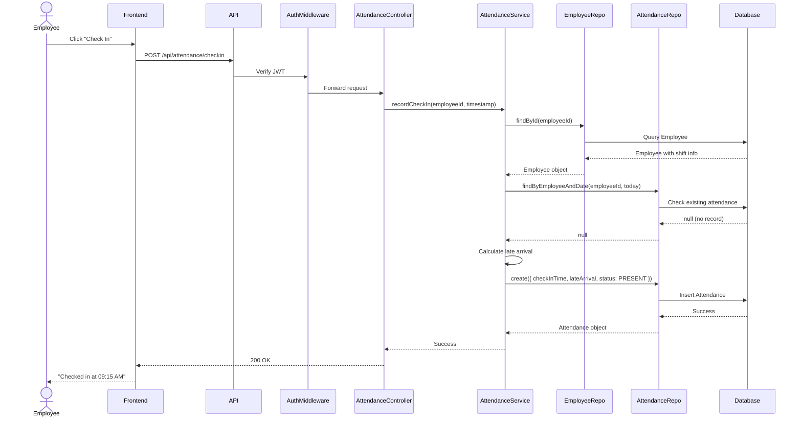
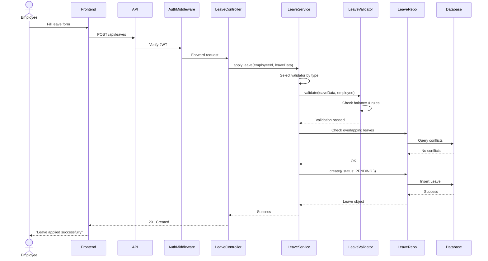
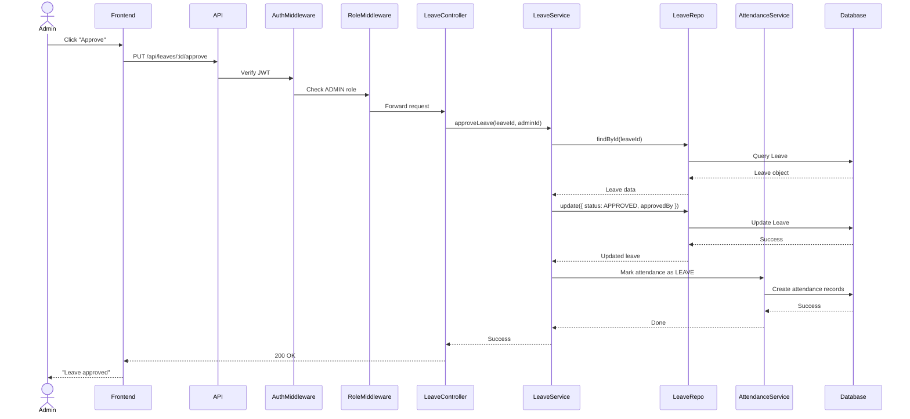
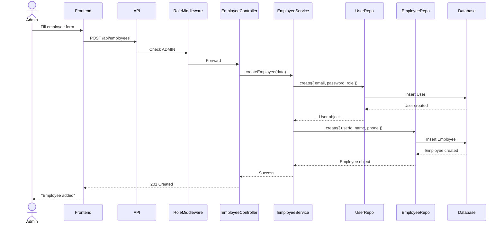

# Sequence Diagrams

## 1. Employee Check-In Flow

```mermaid
sequenceDiagram
    actor Employee
    participant Frontend
    participant API
    participant AuthMiddleware
    participant AttendanceController
    participant AttendanceService
    participant EmployeeRepo
    participant AttendanceRepo
    participant Database

    Employee->>Frontend: Click "Check In"
    Frontend->>API: POST /api/attendance/checkin
    API->>AuthMiddleware: Verify JWT
    AuthMiddleware->>AttendanceController: Forward request
    AttendanceController->>AttendanceService: recordCheckIn(employeeId, timestamp)
    
    AttendanceService->>EmployeeRepo: findById(employeeId)
    EmployeeRepo->>Database: Query Employee
    Database-->>EmployeeRepo: Employee with shift info
    EmployeeRepo-->>AttendanceService: Employee object
    
    AttendanceService->>AttendanceRepo: findByEmployeeAndDate(employeeId, today)
    AttendanceRepo->>Database: Check existing attendance
    Database-->>AttendanceRepo: null (no record)
    AttendanceRepo-->>AttendanceService: null
    
    AttendanceService->>AttendanceService: Calculate late arrival
    AttendanceService->>AttendanceRepo: create({ checkInTime, lateArrival, status: PRESENT })
    AttendanceRepo->>Database: Insert Attendance
    Database-->>AttendanceRepo: Success
    AttendanceRepo-->>AttendanceService: Attendance object
    
    AttendanceService-->>AttendanceController: Success
    AttendanceController-->>Frontend: 200 OK
    Frontend-->>Employee: "Checked in at 09:15 AM"
```

---

## 2. Leave Application Flow

```mermaid
sequenceDiagram
    actor Employee
    participant Frontend
    participant API
    participant AuthMiddleware
    participant LeaveController
    participant LeaveService
    participant LeaveValidator
    participant LeaveRepo
    participant Database

    Employee->>Frontend: Fill leave form
    Frontend->>API: POST /api/leaves
    API->>AuthMiddleware: Verify JWT
    AuthMiddleware->>LeaveController: Forward request
    LeaveController->>LeaveService: applyLeave(employeeId, leaveData)
    
    LeaveService->>LeaveService: Select validator by type
    LeaveService->>LeaveValidator: validate(leaveData, employee)
    LeaveValidator->>LeaveValidator: Check balance & rules
    LeaveValidator-->>LeaveService: Validation passed
    
    LeaveService->>LeaveRepo: Check overlapping leaves
    LeaveRepo->>Database: Query conflicts
    Database-->>LeaveRepo: No conflicts
    LeaveRepo-->>LeaveService: OK
    
    LeaveService->>LeaveRepo: create({ status: PENDING })
    LeaveRepo->>Database: Insert Leave
    Database-->>LeaveRepo: Success
    LeaveRepo-->>LeaveService: Leave object
    
    LeaveService-->>LeaveController: Success
    LeaveController-->>Frontend: 201 Created
    Frontend-->>Employee: "Leave applied successfully"
```

---

## 3. Leave Approval Flow

```mermaid
sequenceDiagram
    actor Admin
    participant Frontend
    participant API
    participant AuthMiddleware
    participant RoleMiddleware
    participant LeaveController
    participant LeaveService
    participant LeaveRepo
    participant AttendanceService
    participant Database

    Admin->>Frontend: Click "Approve"
    Frontend->>API: PUT /api/leaves/:id/approve
    API->>AuthMiddleware: Verify JWT
    AuthMiddleware->>RoleMiddleware: Check ADMIN role
    RoleMiddleware->>LeaveController: Forward request
    LeaveController->>LeaveService: approveLeave(leaveId, adminId)
    
    LeaveService->>LeaveRepo: findById(leaveId)
    LeaveRepo->>Database: Query Leave
    Database-->>LeaveRepo: Leave object
    LeaveRepo-->>LeaveService: Leave data
    
    LeaveService->>LeaveRepo: update({ status: APPROVED, approvedBy })
    LeaveRepo->>Database: Update Leave
    Database-->>LeaveRepo: Success
    LeaveRepo-->>LeaveService: Updated leave
    
    LeaveService->>AttendanceService: Mark attendance as LEAVE
    AttendanceService->>Database: Create attendance records
    Database-->>AttendanceService: Success
    AttendanceService-->>LeaveService: Done
    
    LeaveService-->>LeaveController: Success
    LeaveController-->>Frontend: 200 OK
    Frontend-->>Admin: "Leave approved"
```

---

## 4. Employee Registration Flow

```mermaid
sequenceDiagram
    actor Admin
    participant Frontend
    participant API
    participant RoleMiddleware
    participant EmployeeController
    participant EmployeeService
    participant UserRepo
    participant EmployeeRepo
    participant Database

    Admin->>Frontend: Fill employee form
    Frontend->>API: POST /api/employees
    API->>RoleMiddleware: Check ADMIN
    RoleMiddleware->>EmployeeController: Forward
    EmployeeController->>EmployeeService: createEmployee(data)
    
    EmployeeService->>UserRepo: create({ email, password, role })
    UserRepo->>Database: Insert User
    Database-->>UserRepo: User created
    UserRepo-->>EmployeeService: User object
    
    EmployeeService->>EmployeeRepo: create({ userId, name, phone })
    EmployeeRepo->>Database: Insert Employee
    Database-->>EmployeeRepo: Employee created
    EmployeeRepo-->>EmployeeService: Employee object
    
    EmployeeService-->>EmployeeController: Success
    EmployeeController-->>Frontend: 201 Created
    Frontend-->>Admin: "Employee added"
```