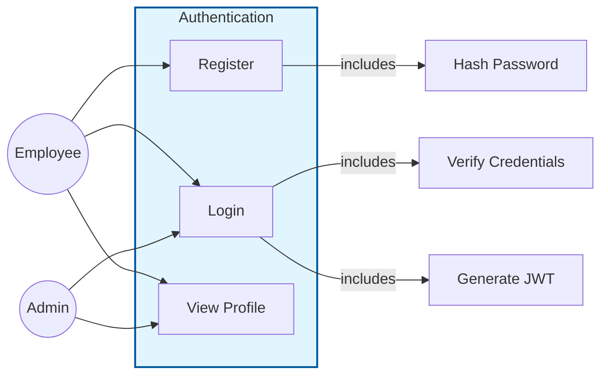
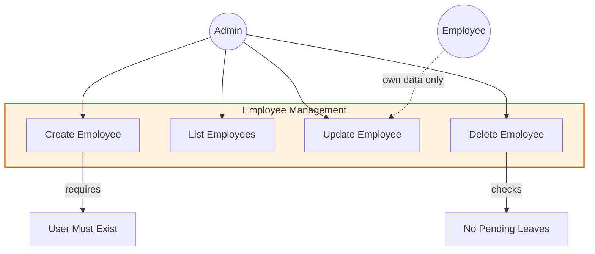
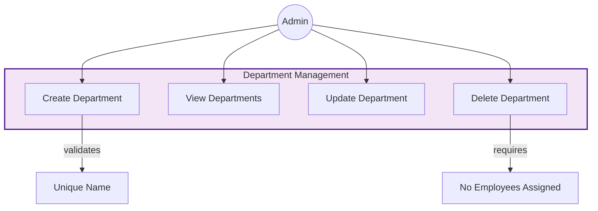
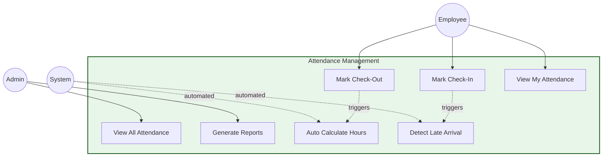
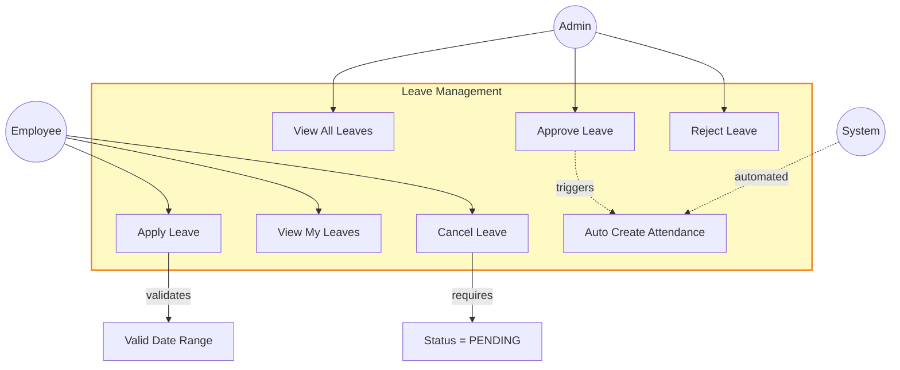
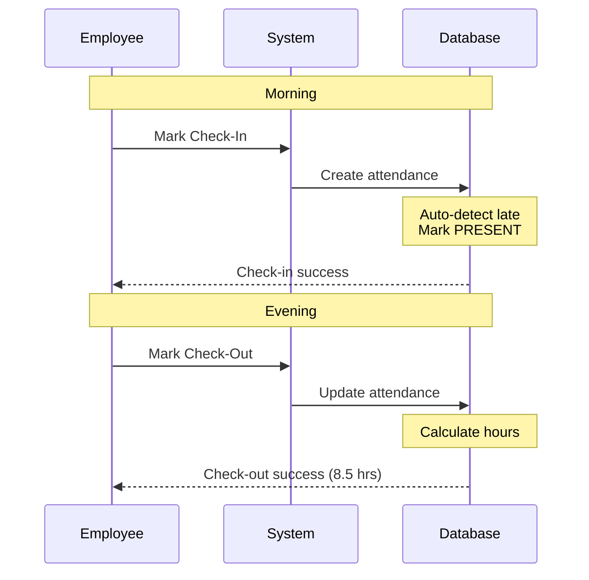
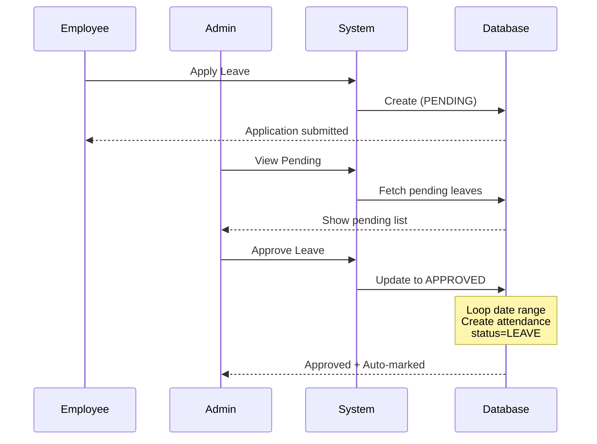
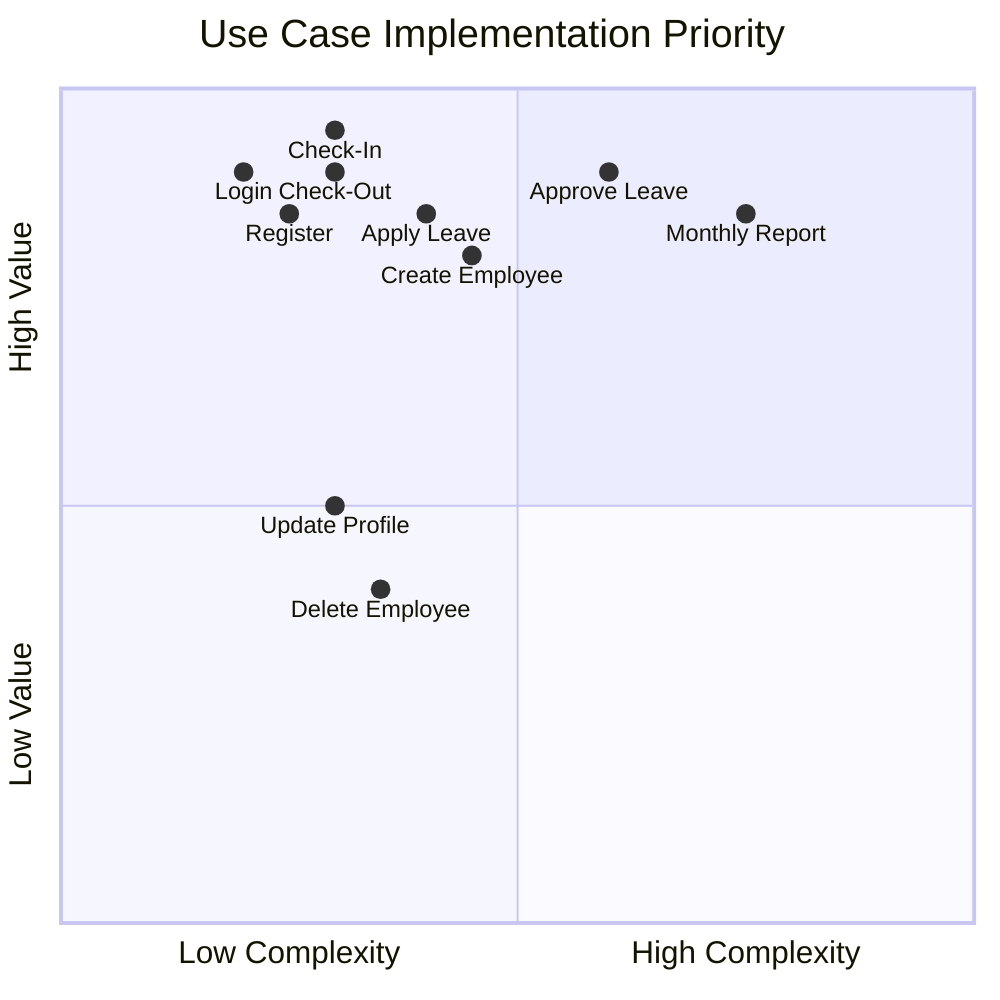

# Use Case Diagram - Employee Management System

## 🎭 Actors

- **👤 Employee** - Regular user (manages own data)
- **👨‍💼 Admin** - System administrator (full access)
- **⚙️ System** - Automated processes

---

## 📊 Complete System Use Case Diagram

```mermaid
graph TB
    Employee((👤<br/>Employee))
    Admin((👨‍💼<br/>Admin))
    System((⚙️<br/>System))
    
    subgraph EMS["Employee Management System"]
        
        subgraph Auth["🔐 Authentication"]
            Login[Login]
            Register[Register]
            ViewProfile[View Profile]
        end
        
        subgraph EmpMgmt["👥 Employee Module"]
            CreateEmp[Create Employee]
            ListEmp[List Employees]
            UpdateEmp[Update Employee]
            DeleteEmp[Delete Employee]
        end
        
        subgraph DeptMgmt["🏢 Department Module"]
            CreateDept[Create Department]
            ManageDept[Manage Departments]
        end
        
        subgraph AttMgmt["📅 Attendance Module"]
            CheckIn[Mark Check-In]
            CheckOut[Mark Check-Out]
            ViewAtt[View Attendance]
            Reports[Generate Reports]
            AutoCalc[Auto Calculate]
        end
        
        subgraph LeaveMgmt["🏖️ Leave Module"]
            ApplyLeave[Apply Leave]
            ViewLeaves[View Leaves]
            ApproveLeave[Approve/Reject]
            AutoAtt[Auto Mark Attendance]
        end
    end
    
    %% Employee actions
    Employee --> Login
    Employee --> Register
    Employee --> ViewProfile
    Employee --> CheckIn
    Employee --> CheckOut
    Employee --> ViewAtt
    Employee --> ApplyLeave
    Employee --> ViewLeaves
    
    %% Admin actions
    Admin --> Login
    Admin --> ViewProfile
    Admin --> CreateEmp
    Admin --> ListEmp
    Admin --> UpdateEmp
    Admin --> DeleteEmp
    Admin --> CreateDept
    Admin --> ManageDept
    Admin --> ViewAtt
    Admin --> Reports
    Admin --> ViewLeaves
    Admin --> ApproveLeave
    
    %% System automated
    System --> AutoCalc
    System --> AutoAtt
    
    %% Triggers
    CheckIn -.trigger.-> AutoCalc
    CheckOut -.trigger.-> AutoCalc
    ApproveLeave -.trigger.-> AutoAtt
    
    style EMS fill:#f9f9f9,stroke:#333,stroke-width:3px
    style Auth fill:#e1f5ff,stroke:#01579b,stroke-width:2px
    style EmpMgmt fill:#fff3e0,stroke:#e65100,stroke-width:2px
    style DeptMgmt fill:#f3e5f5,stroke:#4a148c,stroke-width:2px
    style AttMgmt fill:#e8f5e9,stroke:#1b5e20,stroke-width:2px
    style LeaveMgmt fill:#fff9c4,stroke:#f57f17,stroke-width:2px
```

---

## 🔐 Authentication Use Cases

---

## 👥 Employee Management Use Cases

---

## 🏢 Department Management Use Cases

---

## 📅 Attendance Management Use Cases

---

## 🏖️ Leave Management Use Cases

---

## 🔄 Key Workflows

### Daily Attendance Flow

### Leave Approval Flow

---

## 📋 Use Case Summary Table

### Authentication Module
| ID | Use Case | Actor | Description |
|----|----------|-------|-------------|
| UC-01 | Register | Employee | Create user account |
| UC-02 | Login | Employee, Admin | Authenticate & get JWT |
| UC-03 | View Profile | Employee, Admin | View own details |

### Employee Module
| ID | Use Case | Actor | Description |
|----|----------|-------|-------------|
| UC-04 | Create Employee | Admin | Add new employee |
| UC-05 | List Employees | Admin | View all employees |
| UC-06 | Update Employee | Admin, Employee | Modify employee data |
| UC-07 | Delete Employee | Admin | Remove employee |

### Department Module
| ID | Use Case | Actor | Description |
|----|----------|-------|-------------|
| UC-08 | Create Department | Admin | Add new department |
| UC-09 | View Departments | Admin, Employee | List all departments |
| UC-10 | Update Department | Admin | Modify department |
| UC-11 | Delete Department | Admin | Remove department |

### Attendance Module
| ID | Use Case | Actor | Description |
|----|----------|-------|-------------|
| UC-12 | Mark Check-In | Employee | Record arrival |
| UC-13 | Mark Check-Out | Employee | Record departure |
| UC-14 | View My Attendance | Employee | See own history |
| UC-15 | View All Attendance | Admin | See everyone's attendance |
| UC-16 | Generate Reports | Admin | Daily/monthly reports |
| UC-17 | Auto Calculate | System | Calculate hours worked |
| UC-18 | Detect Late | System | Check if late arrival |

### Leave Module
| ID | Use Case | Actor | Description |
|----|----------|-------|-------------|
| UC-19 | Apply Leave | Employee | Submit leave request |
| UC-20 | View My Leaves | Employee | See own leave history |
| UC-21 | Cancel Leave | Employee | Cancel pending leave |
| UC-22 | View All Leaves | Admin | See all leave requests |
| UC-23 | Approve Leave | Admin | Approve leave request |
| UC-24 | Reject Leave | Admin | Reject leave request |
| UC-25 | Auto Create Attendance | System | Mark attendance for approved leaves |

---

## 🎯 Priority Matrix

---

**Last Updated**: Feb 2026