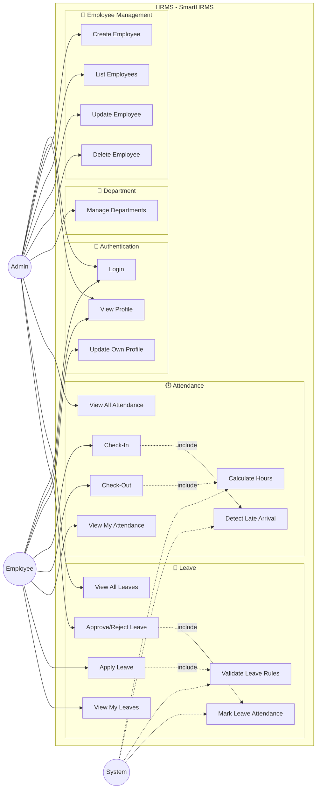

# Use Case Diagram

## 🎭 Actors
- **Employee** - Regular user
- **Admin** - System administrator  
- **System** - Automated processes

---

## 📊 Main Use Case Diagram

---

## 📋 Use Cases Summary

| Use Case | Actor | Description |
|----------|-------|-------------|
| Login | Employee, Admin | Authenticate user with JWT |
| Check-In | Employee | Mark daily check-in with timestamp |
| Check-Out | Employee | Mark check-out, auto-calculate hours |
| View Attendance | Employee, Admin | View attendance history |
| Apply Leave | Employee | Submit leave request with validation |
| Approve/Reject Leave | Admin | Process leave requests |
| Manage Employees | Admin | CRUD operations on employees |
| Manage Departments | Admin | CRUD operations on departments |
| Auto Calculate Hours | System | Calculate total working hours |
| Validate Leave Rules | System | Apply type-specific leave rules |

---