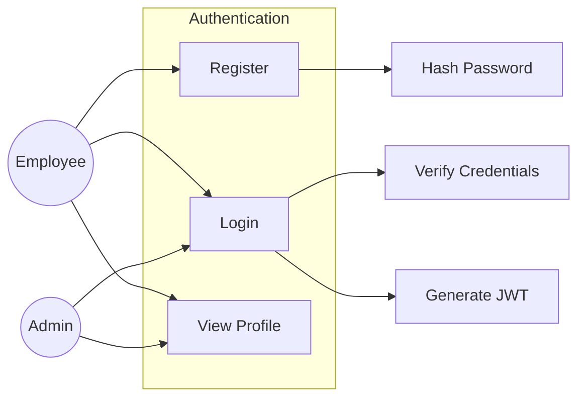
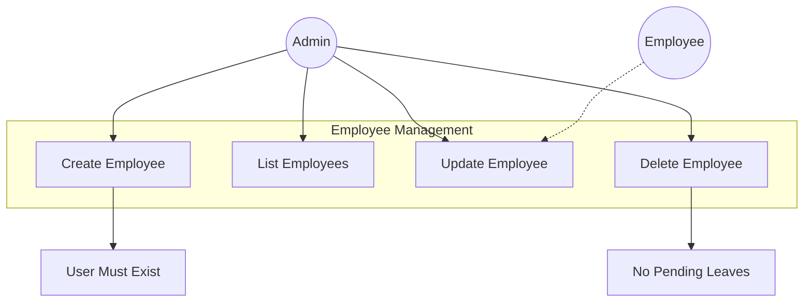
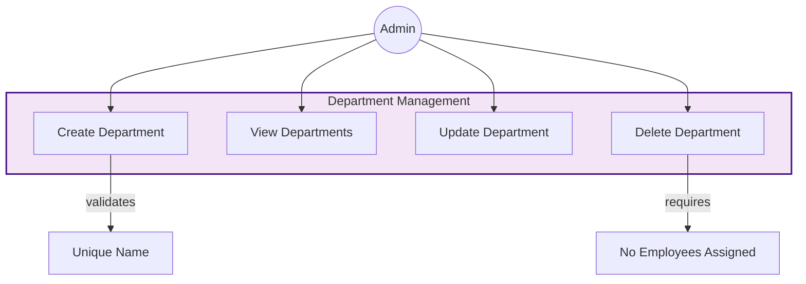
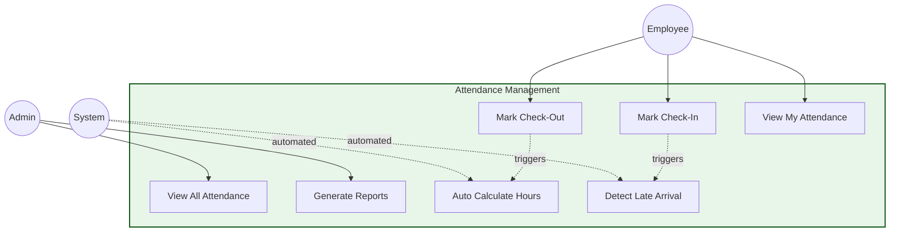
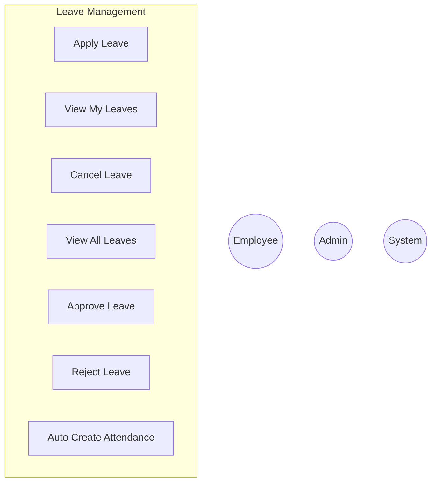

# Use Case Diagram - Employee Management System

## 🎭 Actors

- **👤 Employee** - Regular user (manages own data)
- **👨‍💼 Admin** - System administrator (full access)
- **⚙️ System** - Automated processes

---

## 📊 Complete System Use Case Diagram

```mermaid
graph TB
    Employee((Employee))
    Admin((Admin))
    System((System))
    
    subgraph EMS["Employee Management System"]
        
        subgraph Auth["Authentication"]
            Login[Login]
            Register[Register]
            ViewProfile[View Profile]
        end
        
        subgraph EmpMgmt["Employee Module"]
            CreateEmp[Create Employee]
            ListEmp[List Employees]
            UpdateEmp[Update Employee]
            DeleteEmp[Delete Employee]
        end
        
        subgraph DeptMgmt["Department Module"]
            CreateDept[Create Department]
            ManageDept[Manage Departments]
        end
        
        subgraph AttMgmt["Attendance Module"]
            CheckIn[Mark Check-In]
            CheckOut[Mark Check-Out]
            ViewAtt[View Attendance]
            Reports[Generate Reports]
            AutoCalc[Auto Calculate]
        end
        
        subgraph LeaveMgmt["Leave Module"]
            ApplyLeave[Apply Leave]
            ViewLeaves[View Leaves]
            ApproveLeave[Approve/Reject]
            AutoAtt[Auto Mark Attendance]
        end
    end


    Employee --> Login
    Employee --> Register
    Employee --> ViewProfile
    Employee --> CheckIn
    Employee --> CheckOut
    Employee --> ViewAtt
    Employee --> ApplyLeave
    Employee --> ViewLeaves
    
    Admin --> Login
    Admin --> ViewProfile
    Admin --> CreateEmp
    Admin --> ListEmp
    Admin --> UpdateEmp
    Admin --> DeleteEmp
    Admin --> CreateDept
    Admin --> ManageDept
    Admin --> ViewAtt
    Admin --> Reports
    Admin --> ViewLeaves
    Admin --> ApproveLeave
    
    System --> AutoCalc
    System --> AutoAtt
    
    CheckIn -.-> AutoCalc
    CheckOut -.-> AutoCalc
    ApproveLeave -.-> AutoAtt
```

---

---

## 🏢 Department Management Use Cases

---

## 📅 Attendance Management Use Cases

---

## 🏖️ Leave Management Use Cases

---
